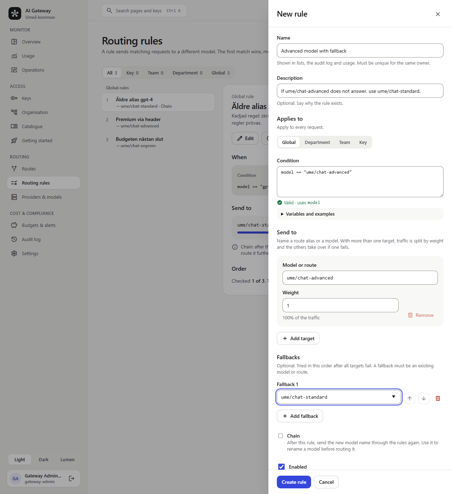
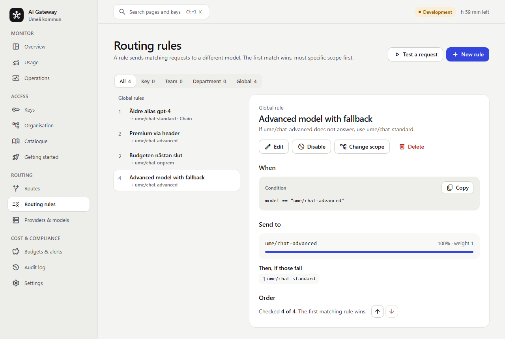
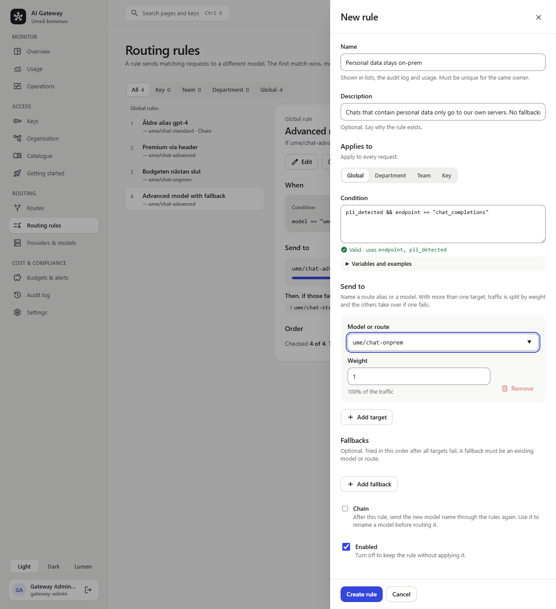
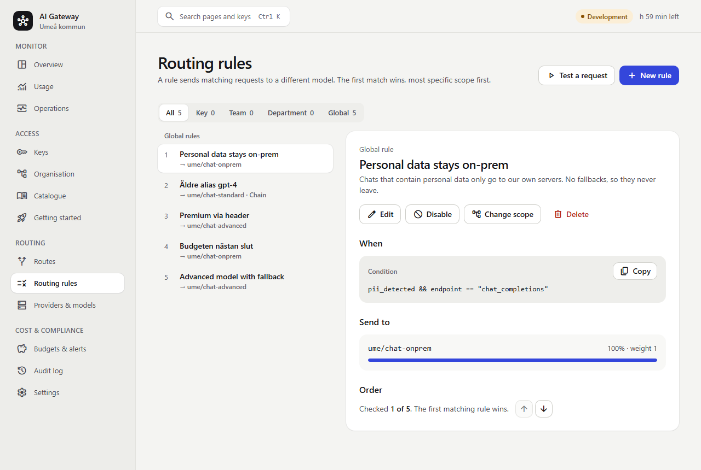
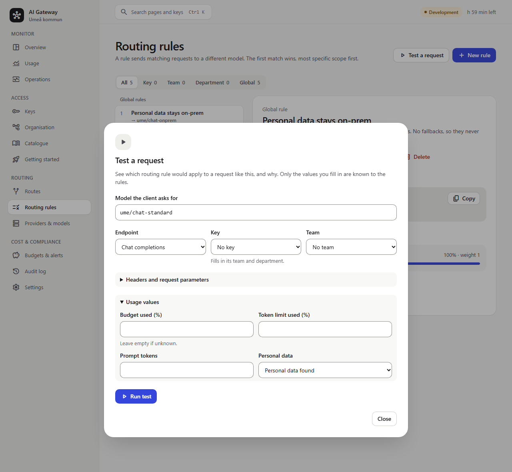
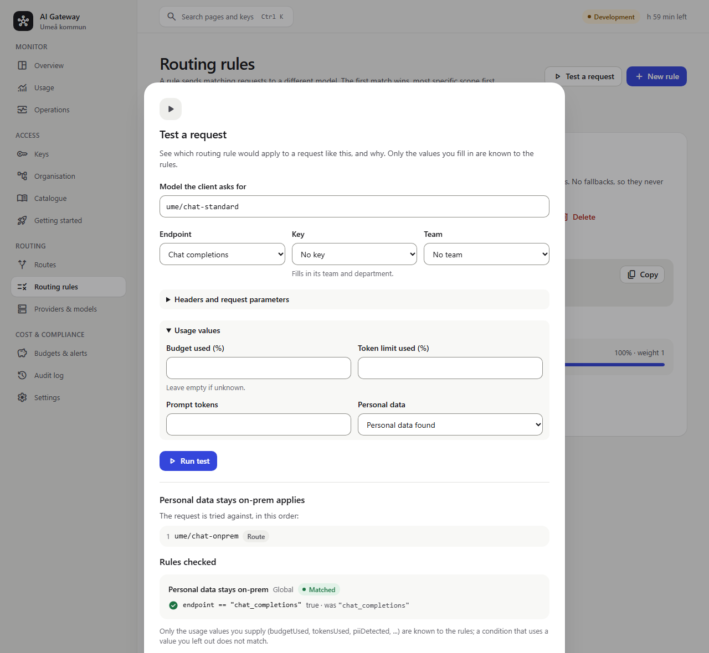
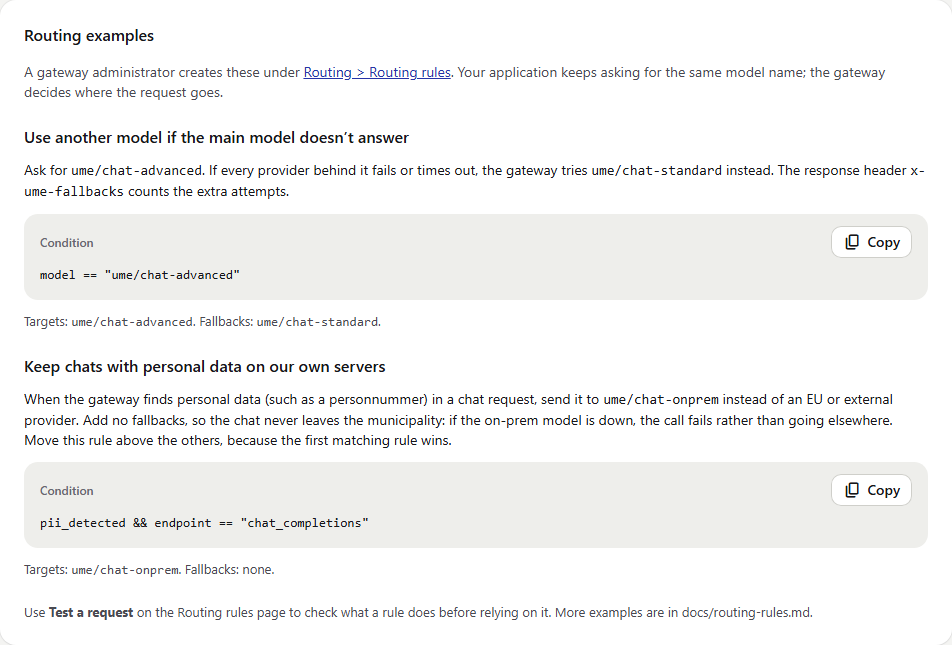

# Umeå kommun LLM gateway POC

.NET 10 data plane and OIDC/BFF control plane, Vue 3/Pinia admin UI, PostgreSQL,
authenticated Redis and Aspire 13.6. This is a demonstrator, **not a production approval,
legal compliance attestation or WCAG certification**.

The gateway provides virtual keys, department/team/key budgets in SEK, provider fallback,
residency restrictions and optional PII policy. It stores usage metadata, never prompt or
response content. Providers/models are configuration, not hardcoded model-family lists.
Routing rules (conditions on headers, team, budget use and PII that rewrite where a request goes,
with weights, fallbacks and chaining) are applied to live requests and described in
[Routing rules](docs/routing-rules.md). The `x-ume-rule` response header shows which rule applied. Administrators manage rules through the admin API
(create, validate, dry-run, reorder, reassign); deleting a team or department that has rules asks whether to delete
the rules or deactivate them until a new team or department is assigned.

## Local development

Windows: .NET SDK 10.0.401, Aspire 13.6, Docker 28+, Node 24.15+ recommended.
Use PowerShell 5.1 and run commands separately (or chain with `;` and exit-code checks).

```powershell
Set-Location src\admin-ui
npm ci
Set-Location ..\..
.\scripts\Start-Dev.ps1          # with demo data (default)
.\scripts\Start-Dev.ps1 -Empty   # empty database, only the Keycloak login users
```

The script wraps `aspire start` + `aspire wait admin-ui`; you can still run those directly
(demo data is then on unless `Seed__Enabled=false` is set in the environment).

### Demo data or an empty environment

Seeding (`Seed:Enabled`) runs in the migration service and **only when the database has no
departments**. Demo data is fictional förvaltningar, teams, providers, models, prices, routes and
a dev key and three example routing rules (see [Routing rules](docs/routing-rules.md)). In the empty variant you sign in with a Keycloak test user (`gateway-admin`) and create
everything yourself. To switch an existing local environment, stop the stack, delete the
AppHost's Postgres Docker volume (`docker volume ls`, then `docker volume rm <name>`; or the
volume named in `DevelopmentVolumes:Postgres`) and start again.

### Fake LLM toggle

The fake provider (`fake-llm`) starts with the AppHost by default. Set `"FakeLlm:Enabled": false`
in the AppHost user secrets (or `FakeLlm__Enabled=false` in the environment) to skip it. The admin UI
badge shows **Development** or **Production** from the admin API's environment.

### Running from Visual Studio

1. Install Visual Studio 2022 17.14+ (or newer) with the .NET 10 SDK, Docker Desktop (running), Node 24+, and run `dotnet dev-certs https --trust` once.
2. Open `UmeLlmGateway.slnx`, set `Ume.LlmGateway.AppHost` as startup project, profile **https**.
3. Right-click the AppHost project > **Manage User Secrets** and paste the dev secrets JSON
   (`Parameters:*` for pepper, dev-key, OIDC secret, dev user password, Redis and **Postgres**
   passwords, plus `DevelopmentVolumes:Postgres`). Keep them stable: the Postgres volume stores the
   password it was created with, and the key pepper hashes all virtual keys, so changing either
   later breaks the existing data. With these set, data survives restarts and `git pull`
   (migrations run automatically). Aspire generates the passwords itself if you skip this step.
4. `"Seed:Enabled": false` = empty environment; `true` or omitted = demo data. It only takes effect on
   an empty database (delete the Postgres Docker volume to switch).
5. Press F5. The Aspire dashboard opens; click the `admin-ui` endpoint. Keycloak test users are
   created from `dev/keycloak`; the shared dev password is the `dev-user-password` secret.

### Environments (dev / test / production)

There is no separate "test" configuration; the mode decides the environment:

| Environment | How | Identity | Data |
|---|---|---|---|
| Development | `aspire start` / `Start-Dev.ps1` (run mode, `Development`) | Keycloak test realm (optional: set `Oidc:Authority` in AppHost user secrets to use an existing provider), FakeLlm, optional Ollama | Demo or empty, see above |
| Test (production-shaped) | `.\deploy\Test-Deployment.ps1` (isolated, throw-away) | Test-only secrets | Empty, never seeded |
| Production | `deploy/compose.prod.yaml` after `deploy/init-deployment.sh` (`ASPNETCORE_ENVIRONMENT=Production`) | External HTTPS OIDC | Never seeded (`Seed__Enabled=false`); no Keycloak or FakeLlm |

Production inputs (OIDC authority/client, certificates, secrets, provider endpoints) are
generated or prompted for by `deploy/init-deployment.sh` (see *Quick production setup* below) and
described in [the runbook](docs/runbook.md). Other settings can be overridden
with `Section__Key` environment variables (for example `Ollama__Enabled=true`, development only).

### Admin UI

`src/admin-ui` is Vue 3 + Pinia + Vue Router with Reka UI primitives and Tailwind CSS v4, built from the design prototype in
`Design prototype/` (tokens in `src/admin-ui/src/styles/tokens.css`, Tailwind config in
`tailwind.config.cjs`). The UI is English only, with light, dark and Lumen themes
(`data-theme`, remembered in `localStorage`). Reusable building blocks live in
`src/components/ui` (buttons, tables, drawers, dialogs, form fields, meters), the page shell in
`src/components/layout`, and pages in `src/views`. Icons are a subset of Material Symbols; after
adding an icon name run `python src/admin-ui/scripts/subset-icons.py` (it needs the Python package `fonttools[woff]`).

#### Routing rules page

**Routing > Routing rules** (gateway-admin) manages [routing rules](docs/routing-rules.md): rules are listed by
scope in the order the gateway checks them, with the selected rule's condition, weighted targets and fallbacks on the
right. From there you can create and edit rules (the condition is validated as you type), switch a rule off, move it
earlier or later, change its owner and delete it. **Test a request** runs a sample request against the stored rules and
shows which rule applies and why. When you delete a team or department in **Organisation** that has routing rules, the UI asks
whether to delete the rules or deactivate them until a new team or department is assigned; deactivated rules show up under
**Needs owner**. Usage shows which rule routed a request.

#### Discovering provider models

Instead of typing models in by hand, open a provider (**Providers & models**) and choose
**Discover models**. The Admin API calls the provider with its stored credential, so a
successful list also proves the connection and credential work. Pick the models to add and
the gateway creates them with what the provider reports:

| Provider | Listing endpoint | Reported details |
|---|---|---|
| OpenAI, OpenAI-compatible, Azure AI Foundry | `GET {baseUrl}/models` | context size and USD prices where present (OpenRouter-style) |
| Anthropic | `GET {baseUrl}/models` | context size and capabilities |
| Ollama, Ollama Cloud | `GET /api/tags` then `POST /api/show` (a trailing `/v1` is stripped from the base URL) | context size and capabilities (tools, vision, thinking, embedding, ...) |
| Azure OpenAI | not supported (deployments are not listable via the data plane) | add models manually |

Capabilities are stored on each model (`features`), shown in the Models table, and can be
edited in the model drawer. Most providers, including Ollama Cloud, do not publish prices, so
add them under the model's price history. Audio, image-generation-only and moderation models
are left out of the list. Models added before this feature have no capabilities until you set
them or re-add them through discovery. Database migration `ModelFeatures` adds the column and
runs with the normal migration service.

The UI is `https://localhost:5173`. Local Keycloak test users/roles are provisioned by
the realm import; get development passwords through Aspire's secret store without
printing them, enabling transcripts or saving browser auth state. Ollama is opt-in:
set `Ollama__Enabled=true` before starting. FakeLlm is the default test provider.
Stop **this exact AppHost** before backend/AppHost edits or builds:

```powershell
aspire stop --apphost src\Ume.LlmGateway.AppHost\Ume.LlmGateway.AppHost.csproj --non-interactive
dotnet build UmeLlmGateway.slnx -v q -nologo
dotnet test --solution UmeLlmGateway.slnx
Set-Location src\admin-ui
npm run lint
npm run typecheck
npm test
```

`npm run lint` fails on warnings, exactly like CI (`npm run lint:fix` fixes most). To catch it before
pushing, enable the pre-commit hook once per clone: `git config core.hooksPath .githooks`.
Debug builds of the admin API (Visual Studio, F5) also run the lint and show problems as a build warning
(skipped when `node_modules` is missing or `CI=true`).

Browser tests (`tests\e2e`, Playwright) need a running stack. Use the separate test database so your
development data is never touched:

```powershell
.\scripts\Start-E2E.ps1          # own Docker volume (ume-e2e-postgres), reset on every start, demo data, fake LLM on
Set-Location tests\e2e
npm ci
npx playwright install chromium
npx tsc --noEmit
npx playwright test
Set-Location ..\..
.\scripts\Start-E2E.ps1 -Stop    # stops the stack and removes the test database
```

The test stack uses the same ports as the dev stack, so stop the dev stack first. The tests cover sign-in, keys
(show-once secret, rotation, revocation), organisation, usage, audit, budgets, the demo scenario, routing
rules (create, validate, test, reorder, disable, delete, team and department deletion and reassignment, key rotation, `budget_used`/`tokens_used`, with real gateway
requests) and accessibility (axe at WCAG 2.2 AA in the three themes, drawers and dialogs, reflow, keyboard,
forced colours, target size). They do not save screenshots, videos, traces or storage state.
Open follow-ups (the manual screen reader pass) are listed in [HANDOVER.md](HANDOVER.md).

### Benchmarks

The gateway's data plane is benchmarked in `benchmarks/Ume.LlmGateway.Benchmarks` (needs Docker; always Release):

```powershell
dotnet run -c Release --project benchmarks\Ume.LlmGateway.Benchmarks -- --filter *   # BenchmarkDotNet, ~20 min
dotnet run -c Release --project benchmarks\Ume.LlmGateway.Benchmarks -- audit        # DB/Redis calls per request + load test
```

Run them before and after changes to the request pipeline. What they measure and the current results are in
[Performance](docs/performance.md).

## Routing examples

Both examples are global rules created under **Routing > Routing rules** (gateway-admin) with the demo data. Your applications keep
asking for the same model name; the rules decide where the request goes. The screenshots were taken from the real UI and are
regenerated by `tests/e2e/docs/screenshots.spec.ts` (see below).

### Example 1: use another model if the main model doesn't answer

*Ask for `ume/chat-advanced`. If every provider behind it fails or times out, try `ume/chat-standard` instead.*

| Field | Value |
|---|---|
| Name | Advanced model with fallback |
| Applies to | Global |
| Condition | `model == "ume/chat-advanced"` |
| Send to | `ume/chat-advanced` (weight 1) |
| Fallbacks | 1. `ume/chat-standard` |



After **Create rule** the rule shows up in the list, in the order the gateway checks it:



How it behaves: the target is tried first (with its own provider order from the route). The fallbacks are tried only when the call fails
in a way that can be retried (a timeout, 408, 409, 429, a 5xx or a provider configuration error), and never after the response has started
streaming. Other client errors (such as 400) are returned as they are. The response header `x-ume-fallbacks` counts the extra attempts and
`x-ume-rule` names the rule. Providers whose circuit breaker is open are moved last, so the fallback is tried before a known-broken primary.

### Example 2 (advanced): chats with personal data go to an on-prem model

*When the gateway finds personal data in a chat (a personnummer, an email address, a phone number, an IBAN), send the request to
`ume/chat-onprem` instead of an EU or external provider.*

| Field | Value |
|---|---|
| Name | Personal data stays on-prem |
| Applies to | Global |
| Condition | `pii_detected && endpoint == "chat_completions"` |
| Send to | `ume/chat-onprem` |
| Fallbacks | none, on purpose |



Three things make this safe:

1. **Order matters: the first matching rule wins.** New rules are added last, so use **Check earlier** (the arrow buttons next to *Order*) until the
   rule is number 1. Otherwise a request with personal data that also matches *Premium via header* would go to `ume/chat-advanced`.
2. **No fallbacks.** If the on-prem model is down the call fails with `503 no_eligible_provider` or `502 all_providers_failed` instead of
   quietly sending the chat to an EU or external provider. Add a fallback only if it is also on-prem.
3. **Rules never widen access.** A key's allowed providers and residencies are applied after the rules, so the rule cannot send a chat anywhere the
   key may not go.



Check the rule before relying on it with **Test a request**: ask for `ume/chat-standard`, open *Usage values* and set *Personal data* to
*Personal data found*:



The result says which rule applies, which models the request is tried against and why each condition was true or false:



On the real gateway (checked with the demo data and a synthetic personnummer): a chat containing `19121212-1212` was served by
`fake-onprem` (`x-ume-residency: OnPrem`, `x-ume-rule` set), while a chat without personal data went to the EU provider as before.

Notes:

- `pii_detected` is evaluated for every request that a rule asks about it, **whatever the key's PII policy** (Off, Allow, Redact), so the rule
  works even for keys that have no PII policy. If the key's policy is **Block**, the request is rejected before the rules run.
- If you only need "personal data stays on-prem" for specific keys, the key's PII policy **Reroute to on-prem** does the same without a rule.
  Use a rule when you want it per team or department, per model, with a chosen on-prem model, or combined with other conditions
  (for example `pii_detected && department_name == "Individ- och familjeomsorgen"`).
- Detection covers Swedish personnummer and samordningsnummer (with checksum), email addresses, Swedish phone numbers and IBANs (not bankgiro numbers).
  It is a safety net, not a guarantee that no personal data reaches a provider.

The same two examples are on the **Getting started** page of the admin UI:



To regenerate the screenshots after a UI change, start the test stack (`.\scripts\Start-E2E.ps1`) and run
`npx playwright test -c playwright.docs.config.ts` in `tests\e2e`. The script builds the two rules through the UI, so it
changes the (disposable) test database only.

## Deployment and documentation

### Quick production setup

On a Linux Docker host (Docker 28+, Compose v2.24+), with the three images built and pushed
(runbook, *Build and publish*) and an OIDC client for the admin UI:

```bash
./deploy/init-deployment.sh        # asks for the OIDC authority and public hostnames
docker compose -f deploy/compose.prod.yaml --env-file deploy/.env up -d --wait
```

`init-deployment.sh` creates an internal CA, service certificates, the Data Protection
certificate, all database/Redis passwords, the key pepper and `deploy/.env`
(non-secret settings, `GATEWAY_IMAGE`/`ADMINAPI_IMAGE`/`MIGRATIONS_IMAGE` overrides).
It is safe to re-run: existing secrets are never overwritten. All options are available
non-interactively (`--help`); `--renew-certs` re-issues the service certificates. Back up
`deploy/secrets/.pepper` and `deploy/certs/data-protection.pfx` separately from database dumps.

No shell access (**Portainer**)? Use `deploy/compose.portainer.yaml`: the same stack configured only through
environment variables, with certificates and secrets generated automatically in Docker volumes on
first start. See the runbook, *Portainer and other hosts without shell access*.

Behind **Nginx Proxy Manager, nginx or an F5** that terminates TLS: add `--proxy` (two hostnames,
an nginx config is generated). With certificates from your **PKI**: pass `--gateway-cert`,
`--gateway-key`, `--admin-cert`, `--admin-key` (and `--ca-file`). Details and the Nginx Proxy
Manager settings are in the runbook, *Reverse proxy and PKI*.

Production never uses the bundled Keycloak: point `UME_OIDC_AUTHORITY` at your existing Keycloak, AD FS or Entra ID.
Roles, department codes and AD groups are mapped by claims; see the runbook, *Identity provider*.

`deploy/compose.prod.yaml` is the recommended, self-contained production file (hardened,
read-only, non-root, internal data network). The older route, `aspire publish -o deploy\generated`
plus `compose.hardening.yaml`, is what `.\deploy\Test-Deployment.ps1` verifies; it is kept in sync
with the new file.

The Aspire-generated alternative: generate Compose with
`aspire publish -o deploy\generated --non-interactive`.
**Never deploy the generated base alone**: use the mandatory hardening override and
operator-mounted secrets/certificates in [the runbook](docs/runbook.md).
`.\deploy\Test-Deployment.ps1` builds and verifies an isolated production-shaped stack
with RAM-only test secrets and cleans up only its own resources.

Open `UmeLlmGateway.slnx` in Visual Studio and select `Ume.LlmGateway.AppHost` as
the startup project. Its `Properties\launchSettings.json` contains the HTTPS/HTTP
dashboard profiles; root `aspire.config.json` selects the same project for CLI commands.
The original development secret-store ID is preserved. When migrating an existing
checkout, set `DevelopmentVolumes:Postgres` (and `DevelopmentVolumes:Ollama`, if used)
in AppHost user secrets to the previous Docker volume names before starting, so existing
development data is reused. These optional overrides apply only in local run mode.

| Document | Purpose |
|---|---|
| [Admin API](docs/admin-api.md) | UI/API contract |
| [Routing rules](docs/routing-rules.md) | Rule model, condition language, evaluation order, examples (see also *Routing examples* above) |
| [Architecture](docs/architecture.md) | Scope and decisions, components, trust boundaries, tradeoffs |
| [Performance](docs/performance.md) | Per-request cost (Postgres/Redis round trips, caching), benchmarks and how to run them |
| [Security and compliance](docs/security-and-compliance.md) | Controls, DPIA and processing-record inputs, release gates |
| [Accessibility statement](docs/accessibility-statement.md) | Automated evidence and outstanding manual checks |
| [Runbook](docs/runbook.md) | Deployment, credentials, backups, incidents |
| [Upgrade guide](docs/upgrade-guide.md) | Migration, rollback, certificates |
| [ADRs](docs/adr.md) | Key design decisions |
| [Demo script](docs/demo-script.md) | Safe repeatable demonstration |
| [Handover](HANDOVER.md) | Current status, open items, conventions and gotchas |
| [Changelog](CHANGELOG.md) | Changes per release |
