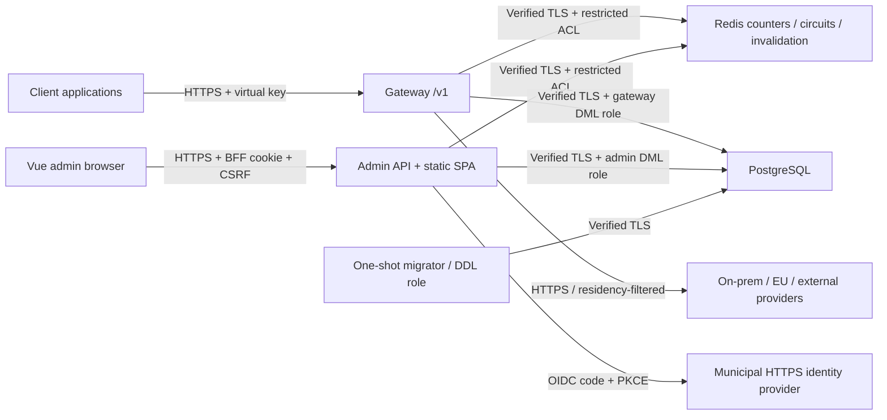

# Architecture

## Components and trust boundaries

The data plane has no admin endpoints; the control plane never proxies LLM traffic.
Production Vue files are served by Admin API, not a Vite server. No browser OIDC tokens
are saved. Local Aspire uses Keycloak and FakeLlm; production uses an operator-approved
HTTPS IdP and provider configuration. Model IDs, capabilities, parameter profiles,
prices and fallback targets are data-driven.

Compose: `data` is internal and has no DB/cache host ports. `edge` contains the two
HTTPS APIs on separate loopback-bound listeners by default. `llm` is a separate gateway
network for provider connectivity; it is not itself an egress firewall. Municipal
firewall/DNS controls must enforce actual allowed destinations, management access and
public exposure. Admin API shares Redis for audited circuit controls/invalidation;
isolating Redis to the gateway alone would break these control-plane functions.

## Request and accounting flow

Bounded JSON request -> HMAC authentication -> model/endpoint authorization -> Redis
rate limit -> optional PII policy -> residency/capability route filter -> hierarchical
budget reservation -> provider invocation -> usage reconciliation -> metadata writer.
Fallback occurs for retryable/provider-configuration failures, never after streaming
has sent bytes. Unknown JSON fields pass through; model parameter rewrites are explicit.
Anthropic/OpenAI translation covers the implemented text/tool/streaming paths.

Budgets are calendar-aligned in Europe/Stockholm; persisted timestamps are UTC.
Reservations atomically check every budget. Rotation shares predecessor budgets and
spend, including grace-period keys. Redis counters rebuild from persisted usage on a
cold start. Pricing uses effective-date USD rates and SEK exchange rates.

The bounded usage channel back-pressures requests. It is **not a durable queue**:
process/host failure can lose unpersisted metadata and cold-start budget reconstruction
can lag in-flight usage. Streaming estimates can differ from provider billing.
Production financial assurance requires durable accounting/reconciliation and tested
availability objectives; this POC must not be presented as exact invoicing.

## Stored and transient data

Postgres stores organization, key HMACs/prefixes, encrypted provider credentials,
certificate-protected Data Protection keys, routes/prices/budgets, metadata-only usage,
alerts and masked append-only audit entries. Redis stores namespaced numerical counters,
circuit state and invalidation signals. Neither stores conversation content.
Bodies are processed transiently in memory and sent to authorized providers; provider
retention/training behavior is a separate contractual and technical responsibility.

HMAC pepper, Redis/database passwords, OIDC secret and certificates are mounted from
operator-managed per-service secret directories. Certificate/pepper continuity matters:
losing the pepper invalidates existing keys; losing the Data Protection certificate/key
ring makes existing provider credentials and BFF state unreadable.

## Operational surfaces

`/health/live`, `/health/ready`, `/version` are metadata-only. OTel metrics use bounded
labels for request outcomes, providers, endpoints, tokens, cost, duration and queue depth.
The authenticated ops API displays component status, schema/version, provider statistics,
drain/circuit actions and key-cache invalidation. Reachability is not a successful upstream
inference probe; an idle provider's historical latency is unavailable, not zero.

See [ADRs](adr.md), [runbook](runbook.md) and the exact [API contract](admin-api.md).
