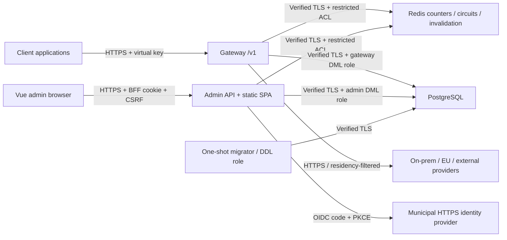

# Architecture

## Components and trust boundaries

The data plane has no admin endpoints; the control plane never proxies LLM traffic.
Production Vue files are served by Admin API, not a Vite server. No browser OIDC tokens
are saved. Local Aspire uses Keycloak and FakeLlm; production uses an operator-approved
HTTPS IdP and provider configuration. Model IDs, capabilities, parameter profiles,
prices and fallback targets are data-driven.

Compose: `data` is internal and has no DB/cache host ports. `edge` contains the two
HTTPS APIs on separate loopback-bound listeners by default. `llm` is a separate gateway
network for provider connectivity; it is not itself an egress firewall. Municipal
firewall/DNS controls must enforce actual allowed destinations, management access and
public exposure. Admin API shares Redis for audited circuit controls/invalidation;
isolating Redis to the gateway alone would break these control-plane functions.

## Request and accounting flow

Bounded JSON request -> HMAC authentication -> key attachment policy -> model/endpoint authorization -> Redis
rate limit -> optional PII policy -> routing rules (optional, see routing-rules.md) -> residency/capability route filter -> hierarchical
budget reservation -> provider invocation -> usage reconciliation -> metadata writer.
Fallback occurs for retryable/provider-configuration failures, never after streaming
has sent bytes. Unknown JSON fields pass through; model parameter rewrites are explicit.
Anthropic/OpenAI translation covers the implemented text/image/document/tool/streaming paths; content the Messages API
cannot take (audio, other file types) is rejected with `unsupported_content` rather than dropped.

With warm caches the request path makes no Postgres calls and two Redis round trips before the first byte (rate limit
pipelined with circuit state; one atomic budget reservation), plus one pipelined round trip for reconciliation after the
response. Key and catalogue caches are refreshed in the background when they expire and dropped immediately on an admin
invalidation. Details and benchmarks: [performance.md](performance.md).

### Routing rules

Optional administrator-defined rules (see [routing-rules.md](routing-rules.md)) run after the PII policy and before candidate selection. A rule matches on the request
(model name, headers, selected body parameters, key/team/department, budget and token-limit use, PII found, prompt size) and rewrites where it goes: weighted targets,
ordered fallbacks and optional chaining. Rules are stored in Postgres (`RoutingRules`, `RoutingRuleTargets`), compiled once per catalogue snapshot (invalid rules are skipped
and logged), and invalidated like other configuration over the Redis bus (30 s cache as fallback). `IRouteResolver` turns a decision into an attempt list and applies every hard
constraint afterwards, so a rule can never widen a key's access. The matched rule id is returned in `x-ume-rule` and stored on the usage record; credentials and prompt content are never
visible to conditions. The admin API (`/api/routing-rules`) audits every change and offers validation and a dry run.

Budgets are calendar-aligned in Europe/Stockholm; persisted timestamps are UTC.
Reservations atomically check every budget. Rotation shares predecessor budgets and
spend, including grace-period keys. Redis counters rebuild from persisted usage on a
cold start. Pricing uses effective-date USD rates and SEK exchange rates.

The bounded usage channel back-pressures requests. It is **not a durable queue**:
process/host failure can lose unpersisted metadata and cold-start budget reconstruction
can lag in-flight usage. Streaming estimates can differ from provider billing.
Production financial assurance requires durable accounting/reconciliation and tested
availability objectives; this POC must not be presented as exact invoicing.

## Stored and transient data

Postgres stores organization, key HMACs/prefixes, encrypted provider credentials,
certificate-protected Data Protection keys, routes/routing rules/prices/budgets, metadata-only usage,
alerts and masked append-only audit entries. Redis stores namespaced numerical counters,
circuit state and invalidation signals. Neither stores conversation content.
Bodies are processed transiently in memory and sent to authorized providers; provider
retention/training behavior is a separate contractual and technical responsibility.

HMAC pepper, Redis/database passwords, OIDC secret and certificates are mounted from
operator-managed per-service secret directories. Certificate/pepper continuity matters:
losing the pepper invalidates existing keys; losing the Data Protection certificate/key
ring makes existing provider credentials and BFF state unreadable.

## Operational surfaces

`/health/live`, `/health/ready`, `/version` are metadata-only. OTel metrics use bounded
labels for request outcomes, providers, endpoints, tokens, cost, duration and queue depth.
The authenticated ops API displays component status, schema/version, provider statistics,
drain/circuit actions and key-cache invalidation. Reachability is not a successful upstream
inference probe; an idle provider's historical latency is unavailable, not zero.

## Scope and confirmed decisions

Originally approved scope, kept here after the delivery plan was retired. It is a POC; the
[security and compliance](security-and-compliance.md) release gates still apply.

| Topic | Decision |
|---|---|
| Providers | Ollama (local and cloud), Azure OpenAI, Azure AI Foundry, OpenAI, Anthropic, generic OpenAI-compatible (vLLM etc.) |
| Hierarchy | Department (förvaltning) -> team -> virtual key, budgets at every level |
| Admin auth | Generic OIDC through a BFF; Keycloak in local run mode, an external HTTPS IdP in production |
| Content logging | Metadata only; prompts and responses are never persisted |
| PII guard | Optional, per key: Off / Allow / Redact / Block / Reroute to on-prem |
| Currency | Budgets in SEK; prices in USD with a configurable USD to SEK rate |
| Client API | OpenAI `/v1/chat/completions` (SSE), `/v1/embeddings`, `/v1/models`, `/v1/responses`; Anthropic `/v1/messages` |
| Budget exceeded | Hard block at 100 %, alerts at configurable thresholds |
| Key rotation | Per rotation: immediate revoke (default) or 24 h grace |
| Rate limits | Per key (requests and tokens), Redis-backed, Redis secured by default |
| Provider classification | OnPrem / EU / External; drives PII rerouting and key residency limits |
| Admin UI | Vue 3 + Pinia + Tailwind CSS v4, English, light/dark/Lumen, accessibility target WCAG 2.2 AA (see the [statement](accessibility-statement.md)) |

Out of scope for the POC: semantic caching, an MCP gateway, SSO for gateway clients (keys only),
an automated exchange-rate feed, and invoicing integration (CSV export per cost centre instead).

See [ADRs](adr.md), [runbook](runbook.md) and the exact [API contract](admin-api.md).
